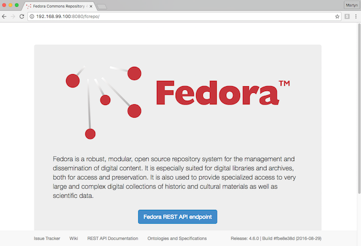

# Willow


## Introduction

[willow](https://github.com/CottageLabs/willow) is an implementation of the Fedora/Hydra stack by [Cottage Labs](http://cottagelabs.com/). It is built with Docker containers, which simplify development and deployment onto live services.


## Getting Started

1. Install [Docker Compose and Docker](https://docs.docker.com/compose/install/) on your machine - *both tools are required*

2. Open a Docker console

3. Clone this repository to a suitable place:
    
    ```$ cd /some/working/directory
    $ git clone https://github.com/CottageLabs/willow.git
    $ cd willow```

4. Create a `.env` file to set the PostGres username and password, you can use the `example.env` file as a template:
    
    ```POSTGRES_USER=postgres
    POSTGRES_PASSWORD=password```

5. Run docker-compose to download, build and initialise the infrastructure
    
    ```$ docker-compose up```
6. If everything is successful, after a few minutes you should be able to navigate to `http://<docker_machine_ip>:8080/fcrepo/` and see Fedora Commons 4.x running
    
=======
[clio](https://github.com/CottageLabs/clio) is an implementation of the Fedora/Hydra stack by [Cottage Labs](http://cottagelabs.com/). It is built with Docker containers, which simplify development and deployment onto live services.


### Tips for  Ubuntu

Follow docker-compose's documentation for installing it on Ubuntu at the link above. Then download the code and setup the environment as previously described.

Depending on how/where you have installed docker-compose and docker, you *may* need to run with `sudo` priviliages (e.g. ```$ sudo docker-compose up```).

The Docker machine IP address is probably just your localhost, so try the URL `http://localhost:8080/fcrepo/` after the system has built.
