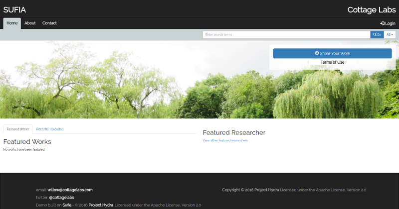

# Willow

[ ](https://app.codeship.com/projects/210883)

## Introduction

[willow](https://github.com/CottageLabs/willow) is an implementation of the Fedora/Hydra stack by [Cottage Labs](http://cottagelabs.com/). It is built with Docker containers, which simplify development and deployment onto live services.


## Getting Started

1. Install Docker [by following step 1 of the Docker Compose installation tutorial](https://docs.docker.com/compose/install/) on your machine.

2. Make sure you don't need to `sudo` to run docker. [Instructions on set-up and how to test that it works.](https://docs.docker.com/engine/installation/linux/ubuntulinux/#/manage-docker-as-a-non-root-user)

3. Install [Docker Compose by following steps 2 and onwards from the Docker Compose installation Tutorial](https://docs.docker.com/compose/install/).

> Ubuntu Linux users, the command that Docker-Compose provides you with will not work since /usr/local/bin is not writeable by anybody but root in default Ubuntu setups. Use `sudo tee` instead, e.g.:
  
```bash
$ curl -L https://github.com/docker/compose/releases/download/[INSERT_DESIRED_DOCKER_COMPOSE_VERSION_HERE]/docker-compose-`uname -s`-`uname -m` | sudo tee /usr/local/bin/docker-compose > /dev/null && sudo chmod a+x /usr/local/bin/docker-compose
```

4. Open a console and try running `docker -h` and `docker-compose -h` to verify they are both accessible.

5. Clone this repository to a suitable place:
```bash
$ cd /some/working/directory
$ git clone https://github.com/CottageLabs/willow.git
$ cd willow
```

6. Initiate the Geoblacklight and willow_sword submodules

```bash
$ git submodule update --init --recursive
```

7. Create three environmental variable files: `.env`, `.env.production` and `.env.development`,  to set the postgres database username and password and also other keys. You can use the `example.env`, `example.env.production` and `example.env.development` files as templates:

__example .env file__
```bash
# POSTGRES_HOST=hostname, defaults to "db" used by docker-compose
# POSTGRES_PORT=5432 by default
# FEDORA_URL_SCHEME, FEDORA_HOST and FEDORA_PORT can be set. Default values are provided if not set.
# SOLR_URL_SCHEME, SOLR_HOST and SOLR_PORT can be set. Default values are provided if not set.
# REDIS_HOST and REDIS_PORT can be set. Default values are provided if not set.
POSTGRES_USER=postgres
POSTGRES_PASSWORD=password

# this should be a very long random key. You can use "$ bundle exec rake secret" to generate one.
SECRET_KEY_BASE_TEST=fb350a4ff22efffba83ff0d73e6a73b0bbca9cdb22683c61e49d8f57280a3988e8c79323c48382a0c565b3db1d7f8bf0924d27542c3322db898948f50530879e


# ------------ OPTIONAL PARAMETERS BELOW HERE -------------


# Serve Willow on port 80 (default is 3000)
WILLOW_EXPOSED_PORT=80

# Serve Geoblacklight on port 81 (default is 3010)
GEOBLACKLIGHT_EXPOSED_PORT=81
```

__example .env.production file__
```bash
# You will probably need to set POSTGRES_HOST and possibly POSTGRES_PORT in production (see example.env above).

# this should be a very long random key. You can use "$ bundle exec rake secret" to generate one.
SECRET_KEY_BASE_PRODUCTION=

# Do not seed Willow data
WILLOW_SEED=false

# Do not seed Geoblacklight data
GEOBLACKLIGHT_SEED=false

# Serve static assets
RAILS_SERVE_STATIC_FILES=true


# Willow messaging stream: either to the AWS cloud or on a local Kinesalite instance
# Set to "aws" for AWS, or "kinesalite" for local Kinesalite, or "false" for none
MESSAGE_STREAM=aws

# Shards, stream name and partition settings
MESSAGE_STREAM_NAME=willow-message-stream
MESSAGE_STREAM_SHARD_COUNT=1
MESSAGE_STREAM_PARTITION_KEY=willow

# Endpoint only used when MESSAGE_STREAM=kinesalite
# MESSAGE_STREAM_ENDPOINT=http://kinesalite:4567


# Only used when MESSAGE_STREAM=aws
MESSAGE_STREAM_REGION=eu-west-1
# Amazon AWS credentials
AWS_ACCESS_KEY_ID=<some AWS access key>
AWS_SECRET_ACCESS_KEY=<some AWS secret key>

# Email-related settings
SMTP_HOST=localhost
SMTP_PORT=587
SMTP_USERNAME=user
SMTP_PASSWORD=pass
# SMTP_HELO_DOMAIN is not required for all servers. Amazon SES does not need it.
# SMTP_HELO_DOMAIN=cottagelabs.com

CONTACT_FORM_RECIPIENT_EMAIL=repo-admin@your-institution.ac.uk
CONTACT_FORM_SENDER_EMAIL=repo-admin@your-institution.ac.uk
CONTACT_FORM_SUBJECT_PREFIX="Willow Contact form:"
NOTIFICATIONS_EMAIL_DEFAULT_FROM_ADDRESS=notifications@your-institution.ac.uk
# USER_MANAGEMENT_EMAIL_FROM_ADDRESS is used for things like Forgotten Password.
# Make sure it's an email + domain you are allowed to send on behalf of, or your user management emails won't work!
USER_MANAGEMENT_EMAIL_FROM_ADDRESS=no-reply@your-institution.ac.uk
# Where should links in emails go to? The following options configure the stem / base URL for those links:
EMAIL_BASE_URL_HOST=repository.your-institution.ac.uk
EMAIL_BASE_URL_SCHEMA=https

# Batch works editing
BATCH_USER=repo_batch_user@your-institution.ac.uk
AUDIT_USER=repo_audit_user@your-institution.ac.uk

# Analytics
GOOGLE_ANALYTICS_ID=UA-99999999-1
```

__example .env.development file__
```bash
# this should be a very long random key. You can use "$ bundle exec rake secret" to generate one.
SECRET_KEY_BASE_DEVELOPMENT=17fc18b3926912d145c29687e324cc351ab3ac7482487e393d9dfccb4bbaea2dc9960dc2d4a154052832971602af315eb79cbb1b9879b5861a102c3bf9f32a2f

# Set to true to seed Willow data
WILLOW_SEED=true

# Set to true to seed Geoblacklight data
GEOBLACKLIGHT_SEED=true


# Willow messaging stream: either to the AWS cloud or on a local Kinesalite instance
# Set to "aws" for AWS, or "kinesalite" for local Kinesalite, or "false" for none
MESSAGE_STREAM=kinesalite

# Shards, stream name and partition settings
MESSAGE_STREAM_NAME=willow-message-stream
MESSAGE_STREAM_SHARD_COUNT=1
MESSAGE_STREAM_PARTITION_KEY=willow

# Endpoint only used when MESSAGE_STREAM=kinesalite
MESSAGE_STREAM_ENDPOINT=http://kinesalite:4567

# see example.env.production if you're developing an email-related feature. In that case you might
# want to set some email-related environment variables.
```

8. Run `docker-compose up` to download, build and initialise the infrastructure

The system can be built and run in either *development* mode (allowing changes on the fly) or in *production* mode (where code and assets are pre-built and cannot be changed on startup).
 
To enable development mode, you should symlink the file `docker-compose.development.yml` to `docker-compose.override.yml`.
Conversely, to enable production mode, simply delete the `docker-compose.override.yml` file if it exists.

__enabling development mode__
```bash
$ ln -sf docker-compose.development.yml docker-compose.override.yml
```

__enabling production mode__
```bash
$ rm -f docker-compose.override.yml
```

To build and run the system, issue the `up` command to docker-compose: 
```bash
$ docker-compose up --build
```

Note that once the system has been built, the image will be cached. You can force a rebuild with `docker-compose up --build`.


And to start from a blank slate by completely wiping the system and data, run `docker-compose down --volumes` first:
```bash
$ docker-compose down --volumes && docker-compose up --build 
```


9. If everything is successful, after a few minutes you should be able to see Willow running.
  - Willow:
    - Mac: http://192.168.99.100:3000 (or possibly port 80 depending on your `env` files)
    - Linux: http://localhost:3000

  
  
  - Geoblacklight:
    - Mac: http://192.168.99.100:3010
    - Linux: http://localhost:3010
    
    
10. To get a bash prompt within the Willow container (e.g. to run rake tasks), you can run:
```bash
$ docker-compose run --rm willow bash
```

11. To get a rails console within the Willow container for debugging, you can run:
```bash
$ docker-compose run --rm willow rails console
```

12. To run the full Willow test suite, use:
```bash
$ docker-compose run --rm -e RAILS_ENV=test willow rake spec
```

13. JISC RDSS message schemas tests
  
  There are some tests defined which require 3rd party Json schemas defined in a private repository: https://github.com/JiscRDSS/rdss-message-api-docs/
  If you have access to this private repository, do the following steps: 

  - Ensure the path "/willow/spec/fixtures/files/schemas/jisc_rdss/*" is in your `.gitignore` file.

  - Then, copy the following files and folders to the given locations:
    -  https://github.com/JiscRDSS/rdss-message-api-docs/tree/master/messages  => willow/willow/spec/fixtures/files/schemas/jisc_rdss/messages
    -  https://github.com/JiscRDSS/rdss-message-api-docs/tree/master/schemas   => willow/willow/spec/fixtures/files/schemas/jisc_rdss/schemas

  - Be sure that the files above are not committed to git!
